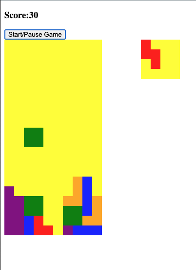

# Tetris

## This is a simple version of Tetris I made to learn Javascript.

Use the arrows keys to move left and right and the up arrow key to rotate, the down arrow key moves the tetrimino downwards.

